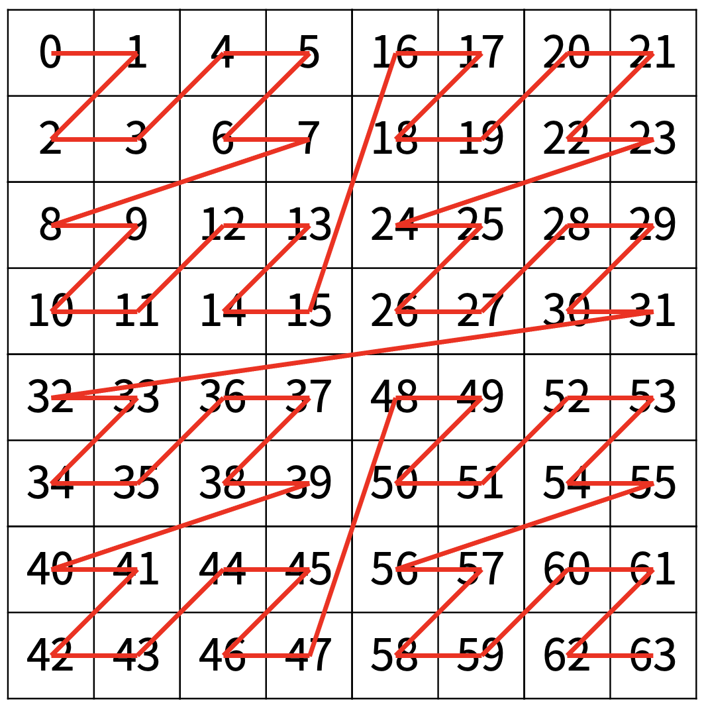

# [Silver 1] Z

[문제 링크](https://www.acmicpc.net/problem/1074) 

### 성능 요약

메모리: 16296 KB, 시간: 160 ms

### 분류

* 분할 정복
* 재귀

### 문제 설명

한수는 크기가 2N × 2N인 2차원 배열을 Z모양으로 탐색하려고 한다. 예를 들어, 2×2배열을 왼쪽 위칸, 오른쪽 위칸, 왼쪽 아래칸, 오른쪽 아래칸 순서대로 방문하면 Z모양이다.

N > 1인 경우, 배열을 크기가 2N-1 × 2N-1로 4등분 한 후에 재귀적으로 순서대로 방문한다.

다음 예는 22 × 22 크기의 배열을 방문한 순서이다.

N이 주어졌을 때, r행 c열을 몇 번째로 방문하는지 출력하는 프로그램을 작성하시오.

다음은 N=3일 때의 예이다.

### 입력 

첫째 줄에 정수 N, r, c가 주어진다.

### 출력 

r행 c열을 몇 번째로 방문했는지 출력한다.
